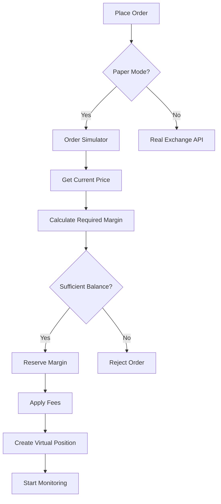

# Paper Trading System

## Overview

The paper trading system provides a complete simulation environment for testing trading strategies without risking real money. It tracks virtual positions, balances, and P&L based on real market data.

## Features

### ✅ Complete Simulation
- **Virtual Balance Tracking**: Simulates USDT balance with proper margin management
- **Position Simulation**: Tracks open positions with entry price, leverage, and unrealized P&L
- **Order Execution**: Simulates market and limit orders based on real market prices
- **TP/SL Triggers**: Automatically triggers take profit and stop loss orders
- **Fee Calculation**: Applies realistic maker (0.02%) and taker (0.04%) fees
- **Liquidation Simulation**: Calculates liquidation prices and simulates forced closures

### 📊 Performance Tracking
- **Session Statistics**: Track wins, losses, win rate, and total P&L
- **Real-time Updates**: Live updates based on market price changes
- **Position Monitoring**: Real-time unrealized P&L for all open positions

## Architecture

### Core Components

```
src/lib/paperTrading/
├── index.ts                      # Main paper trading manager
├── virtualBalance.ts             # Virtual balance tracker
├── virtualPositions.ts           # Position tracking
├── orderSimulator.ts             # Order execution simulator
└── protectiveOrderMonitor.ts    # TP/SL monitoring
```

### Component Responsibilities

#### 1. **PaperTradingManager** (`index.ts`)
- Coordinates all paper trading components
- Manages initialization and lifecycle
- Routes events between components
- Provides main API for paper trading operations

#### 2. **VirtualBalanceTracker** (`virtualBalance.ts`)
- Tracks total balance, available balance, and used margin
- Manages realized and unrealized P&L
- Handles fee deductions
- Maintains session statistics (wins, losses, trades)

#### 3. **VirtualPositionTracker** (`virtualPositions.ts`)
- Maintains open positions with entry price, quantity, leverage
- Creates and fills virtual orders
- Calculates unrealized P&L based on current prices
- Handles position liquidations
- Manages TP/SL settings per position

#### 4. **OrderSimulator** (`orderSimulator.ts`)
- Simulates order placement and execution
- Determines fill prices based on order type
- Calculates and applies trading fees
- Validates margin requirements before execution
- Monitors pending limit orders

#### 5. **ProtectiveOrderMonitor** (`protectiveOrderMonitor.ts`)
- Monitors market prices in real-time
- Checks for TP/SL trigger conditions
- Updates unrealized P&L continuously
- Automatically closes positions when protective orders trigger

## How It Works

### 1. Initialization

When the bot starts in paper mode (`paperMode: true` in config):

```typescript
// Bot automatically initializes paper trading
const paperTrading = getPaperTradingManager(1000); // Start with 1000 USDT
await paperTrading.initialize();
```

### 2. Order Placement

When a trade signal occurs, the bot calls `placeOrder()`:

```typescript
// In src/lib/api/orders.ts
if (isPaperMode) {
  // Route to paper trading simulator
  const result = await paperTrading.placeOrder({
    symbol: 'BTCUSDT',
    side: 'BUY',
    type: 'MARKET',
    quantity: 0.001,
    leverage: 10
  });
}
```

### 3. Order Execution Flow



### 4. Price Updates

Real market prices feed into the paper trading system:

```typescript
// In bot/index.ts
priceService.on('markPriceUpdate', (priceUpdates) => {
  if (config.global.paperMode) {
    for (const [symbol, price] of Object.entries(priceUpdates)) {
      paperTrading.updateMarketPrice(symbol, price);
    }
  }
});
```

### 5. TP/SL Monitoring

The protective order monitor runs continuously:

```typescript
// Checks every second for TP/SL triggers
monitor.start(1000);

// When price reaches TP/SL
if (shouldTrigger) {
  // Calculate final P&L
  const pnl = calculatePnL(position, currentPrice);
  
  // Release margin
  balanceTracker.releaseMargin(position.margin);
  
  // Realize profit/loss
  balanceTracker.realizePnL(pnl, position.margin);
}
```

## Configuration

Enable paper trading in `config.user.json`:

```json
{
  "global": {
    "paperMode": true,
    "riskPercent": 1
  }
}
```

## Fee Structure

Paper trading uses realistic Aster Finance fee rates:

- **Maker Fee**: 0.02% (0.0002)
- **Taker Fee**: 0.04% (0.0004)

Fees are automatically applied on:
- Position entry
- Position exit
- TP/SL triggers

## Margin Calculation

### Required Margin
```
margin = (entry_price × quantity) / leverage
```

### Available Balance
```
available = total_balance - used_margin + unrealized_pnl
```

### Liquidation Price
- **Long**: `entry_price × (1 - 0.9 / leverage)`
- **Short**: `entry_price × (1 + 0.9 / leverage)`

The 0.9 factor accounts for fees.

## Dashboard Display

The paper trading dashboard shows:

- **Total Balance**: Current virtual balance
- **Available Balance**: Balance available for new trades
- **Session P&L**: Total profit/loss this session (with %)
- **Used Margin**: Margin locked in open positions
- **Unrealized P&L**: Current floating profit/loss
- **Realized P&L**: Closed trade profit/loss
- **Win Rate**: Percentage of winning trades
- **Open Positions**: List of all active simulated positions

## API Reference

### Main Manager

```typescript
import { getPaperTradingManager } from '@/lib/paperTrading';

const manager = getPaperTradingManager(initialBalance);

// Initialize
await manager.initialize();

// Place order
const result = await manager.placeOrder({
  symbol: 'BTCUSDT',
  side: 'BUY',
  type: 'MARKET',
  quantity: 0.001,
  price: 50000
});

// Update price
manager.updateMarketPrice('BTCUSDT', 51000);

// Get balance
const balance = manager.getBalance();

// Get positions
const positions = manager.getPositions();

// Get stats
const stats = manager.getSessionStats();

// Reset
manager.reset(1000);
```

### Events

```typescript
// Listen to events
manager.on('balanceUpdate', (balance) => {
  console.log('Balance:', balance);
});

manager.on('positionOpened', (position) => {
  console.log('Position opened:', position);
});

manager.on('positionClosed', (data) => {
  console.log('Position closed:', data);
});

manager.on('protectiveOrderTriggered', (data) => {
  console.log('TP/SL triggered:', data);
});
```

## Testing Strategy

### Recommended Testing Flow

1. **Start with Paper Mode**
   ```json
   { "paperMode": true }
   ```

2. **Configure Small Test Sizes**
   ```json
   {
     "symbols": {
       "BTCUSDT": {
         "tradeSize": 10,
         "leverage": 5
       }
     }
   }
   ```

3. **Monitor Performance**
   - Watch the paper trading dashboard
   - Check win rate and P&L
   - Verify TP/SL triggers work correctly

4. **Adjust Strategy**
   - Modify thresholds, TP%, SL%
   - Test different symbols
   - Refine entry/exit logic

5. **Evaluate Results**
   - Review session statistics
   - Analyze profitable patterns
   - Identify losing scenarios

6. **Switch to Live** (only when confident)
   ```json
   { "paperMode": false }
   ```

## Limitations

### What Paper Trading Simulates

✅ Order execution at market prices  
✅ Margin requirements and balance tracking  
✅ Trading fees (maker/taker)  
✅ TP/SL triggers  
✅ Liquidations  
✅ P&L calculation  

### What Paper Trading Doesn't Simulate

❌ Slippage (uses exact mark price)  
❌ Order book depth  
❌ Partial fills  
❌ Network latency  
❌ Exchange downtime  
❌ Funding rate payments  
❌ Market impact of your orders  

## Best Practices

### 1. Always Start with Paper Trading
Never trade live without testing your strategy in paper mode first.

### 2. Use Realistic Trade Sizes
Test with the same trade sizes you plan to use in live trading.

### 3. Run for Sufficient Time
Test for at least several days to see different market conditions.

### 4. Monitor All Metrics
Don't just look at total P&L - watch win rate, drawdown, and individual trades.

### 5. Test Edge Cases
Simulate scenarios like:
- Multiple positions on same symbol
- Rapid price movements
- Position holding through different timeframes

### 6. Document Your Results
Keep notes on what works and what doesn't.

## Troubleshooting

### Orders Not Executing
- Check that paper mode is enabled
- Verify sufficient virtual balance
- Check trade sizes meet exchange minimums

### TP/SL Not Triggering
- Ensure protective order monitor is running
- Verify price updates are being received
- Check TP/SL prices are set correctly

### Incorrect P&L Calculation
- Verify leverage is correct
- Check fee calculations
- Ensure mark prices are updating

### Balance Not Updating
- Check WebSocket connection
- Verify paper trading manager is initialized
- Look for errors in browser console

## Migration to Live Trading

When ready to switch from paper to live:

1. **Backup Your Config**
   ```bash
   cp config.user.json config.user.backup.json
   ```

2. **Review Paper Trading Results**
   - Minimum 70%+ win rate recommended
   - Positive total P&L
   - Acceptable max drawdown

3. **Start with Minimal Risk**
   ```json
   {
     "global": {
       "paperMode": false,
       "riskPercent": 0.5  // Very conservative
     }
   }
   ```

4. **Monitor Closely**
   - Watch first few trades carefully
   - Be ready to stop bot if issues occur
   - Start during low volatility periods

5. **Scale Gradually**
   - Only increase risk after consistent profitable results
   - Monitor for several days before increasing

## Support

For issues or questions:
- Check the main README.md
- Review CLAUDE.md for general bot documentation
- Check browser console for error messages
- Review bot terminal output for simulation logs

## Future Enhancements

Planned improvements:
- [ ] Configurable starting balance
- [ ] Historical backtesting on past data
- [ ] Export trading results to CSV
- [ ] Position size recommendations
- [ ] Risk analysis tools
- [ ] Strategy comparison
